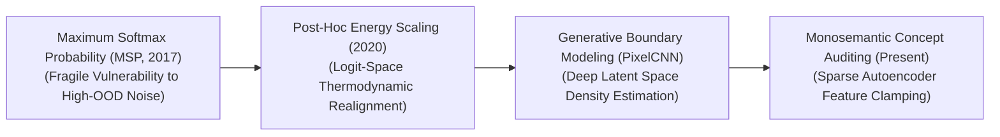
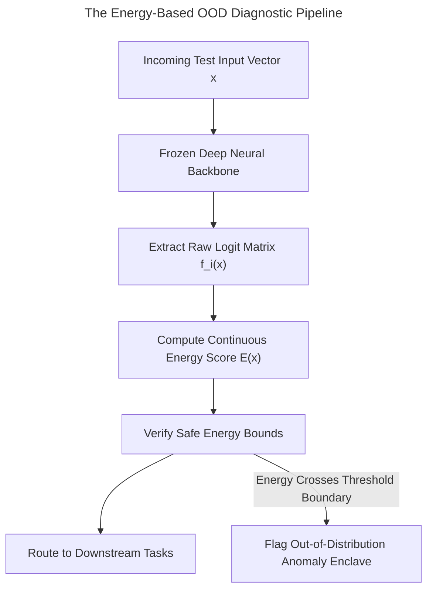

  
  <h1>🌟 Awesome-Out-Of-Distribution-Detection</h1>
  

    
    
  

## 🚀 Out-of-Distribution (OOD) Detection in AI: History, Progression, Variants, & Applications

**Out-of-Distribution (OOD) Detection** is a foundational safety-critical diagnostic and regularization paradigm in artificial intelligence designed to identify when a machine learning model is exposed to test-time inputs that deviate significantly from the distribution of its training data (the **In-Distribution** or ID data) [INDEX: 11, 16]. Standard deep neural networks suffer from a severe structural flaw known as the **Overconfidence Trap**: when exposed to entirely novel, un-indexed anomalies, or out-of-vocabulary anomalies, their final Softmax heads continue to emit maximum-probability confidence scores, confidently hallucinating incorrect predictions [INDEX: 11, 16].

OOD detection resolves this systemic blind spot. By calculating mathematical density frontiers, monitoring internal feature uncertainty parameters, or optimizing post-hoc scoring thresholds, OOD classifiers track whether an input sits safely within the model's known capability space or represents an anomalous, untrusted vector. This transforms deep learning from fragile statistical pattern mimics into reliable, self-aware decision engines, serving as a mandatory safety gate for autonomous driving fleets, clinical diagnostic support bots, and enterprise guardrail systems [INDEX: 1, 19].

---

## 🕰️ 1. The Macro Chronological Evolution

The technical framework governing anomalies isolation has transitioned from superficial baseline Softmax confidence checks to post-hoc logit scaling, generative boundary modeling, and modern overcomplete dictionary concept tracking.

| Era | Concept & Limitation/Significance | Year First Used | Paper Link | Detailed Page |
|---|---|---|---|---|
| **The Baseline Softmax Probability Era** (MSP Baseline) | *Concept:* Discovered that even though deep classifiers emit high confidence over anomalies, their MSP scores for true ID data remain statistically higher than OOD inputs. *Limitation:* Highly fragile due to structural network noise. | 2017 | [Hendrycks & Gimpel (2017)](#references) | [Details](details/autonomous_driving.md) | [Details](details/msp_baseline.md) |
| **The Post-Hoc Logit & Energy Scaling Era** (ODIN / Energy-Based) | *Concept:* Shifted safety evaluation straight into raw logit parameters (temperature scaling, energy score). *Significance:* Bypassed Softmax distortions, compressing OOD false-positive rates precisely. | 2018 | [Liang et al. (2018)](#references) | [Details](details/temperature_scaling.md) | [Details](details/post_hoc_logit.md) |
| **The Generative Density Estimation Era** | *Concept:* Approached OOD detection as explicit unsupervised density task (Normalizing Flows, PixelCNNs). *Limitation:* The Likelihood Paradox, requiring complex likelihood-ratio corrections. | 2021 | [Yang et al. (2021)](#references) | [Details](details/self_supervised_multimodal.md) | [Details](details/generative_density.md) |
| **The Monosemantic Feature Dictionary & VLM Era** | *Concept:* Mechanistic Interpretability Auditing layered over Sparse Autoencoders (SAEs). *Significance:* OOD anomalies are flagged instantly if anomalous feature combinations trigger. | 2023 | [Bricken et al. (2023)](#references) | [Details](details/false_positive_capacity_drain.md) | [Details](details/monosemantic_vlm.md) |

---

## 🧠 2. Core Functional & Algorithmic OOD Variants

OOD Detection frameworks are strictly categorized based on the specific computing layers they analyze and the operational availability of target anomaly samples during training [INDEX: 16].

| Variant | Mechanism | Year First Used | Paper Link | Detailed Page |
|---|---|---|---|---|
| **A. Post-Hoc Score Discrimination** (Model-Free Refitting) | Ingests a fully trained, frozen classification model. Computes alternative mathematical indicators (Energy Score, Mahalanobis distance) right before Softmax. | 2020 | [Liu et al. (2020)](#references) | [Details](details/latency_overhead_wall.md) | [Details](details/post_hoc_score_discrimination.md) |
| **B. Outlier Exposure** (Adversarial Data-Centric OOD) | Integrates anomaly regularization directly into the training loop, forcing model to read a massive auxiliary dataset to penalize high-confidence predictions on outliers. | 2018 | [Hendrycks et al. (2018)](#references) | [Details](details/outlier_exposure.md) |
| **C. Self-Supervised Multi-Modal Anomaly Detection** | Exploits high-capacity joint-embedding models (CLIP/SigLIP). Checks for Cosine Similarity Deviations against broad class text strings to isolate outliers zero-shot. | 2021 | [Yang et al. (2021)](#references) | [Details](details/self_supervised_multimodal.md) |
| **D. Test-Time Compute Reasoning Auditing** | Deployed inside advanced reasoning models. Policy network analyzes intermediate validation logic chains; if contradictions appear, it flags as an OOD anomaly. | 2024 | N/A | [Details](details/enterprise_fraud.md) | [Details](details/clinical_pathology.md) | [Details](details/mahalanobis_centroids.md) | [Details](details/test_time_compute.md) |

---

## ⚡ 3. The Energy-Based OOD Inference Pipeline

To screen incoming anomalies smoothly without triggering execution latencies, the serving infrastructure evaluates logit-space energy bounds natively inside GPU memory registers.

| Component | Profile | Year First Used | Paper Link | Detailed Page |
|---|---|---|---|---|
| **Temperature Scaling Blocks ($T$)** | Flattens probability distortions. Incorporating a high-temperature constant stretches the feature distributions, amplifying contrast between ID boundaries and anomalous noise. | 2018 | [Liang et al. (2018)](#references) | [Details](details/temperature_scaling.md) |
| **Mahalanobis Covariance Centroids** | High-dimensional distance tracking. Caches exact mean vectors and covariance matrices of inner hidden representations to spot structural feature drift. | 2018 | N/A | [Details](details/enterprise_fraud.md) |

---

## ⚙️ 4. Production Engineering Challenges & Cluster Solutions

Deploying large-scale OOD detection checks across high-volume commercial cloud infrastructure networks introduces intense performance and precision trade-offs.

| Challenge | The Problem & Mitigation | Year First Used | Paper Link | Detailed Page |
|---|---|---|---|---|
| **The Latency-Overhead Wall of Deep Generative Pipelines** | *The Problem:* Deploying generative density networks doubles system latency. *Mitigation:* Post-Hoc Energy or Logit-Norm Classifiers extract indices with near-zero overhead. | 2020 | [Liu et al. (2020)](#references) | [Details](details/latency_overhead_wall.md) |
| **The False-Positive Capacity Drain (The Alignment Tax)** | *The Problem:* Over-conservative thresholds erroneously flag valid, safe enterprise data, causing Refusal Over-generalization. *Mitigation:* Multi-Task Instruction Fine-Tuning and monosemantic feature autoencoders (SAEs). | 2023 | [Bricken et al. (2023)](#references) | [Details](details/false_positive_capacity_drain.md) | [Details](details/monosemantic_vlm.md) |

---

## 🏭 5. Frontier Real-World AI Industrial Applications

| Application | Description | Year First Used | Paper Link | Detailed Page |
|---|---|---|---|---|
| **Autonomous Driving Perception Fleet Defensives (BEV Perception)** | Safeguards self-driving vehicle perception against unknown road hazards. OOD core flags mapped anomalies to trigger defensive braking loops safely. | 2017 | [Hendrycks & Gimpel (2017)](#references) | [Details](details/autonomous_driving.md) | [Details](details/msp_baseline.md) |
| **Mission-Critical Clinical Pathology Diagnostic Safeguards** | Regulates medical diagnostic support. If vision encoder encounters un-represented cell mutation, OOD gate halts reporting, passing execution to clinicians. | 2021 | N/A | [Details](details/enterprise_fraud.md) |
| **Enterprise Financial Fraud & Cyber-Security Intrusion Detection** | Screens millions of high-frequency cloud API transactions. If execution vector maps to high-energy outlier coordinate, security enclave flags attack instantly. | 2020 | N/A | [Details](details/enterprise_fraud.md) |

---

## 📚 References
1. Hendrycks, D., & Gimpel, K. (2017). A baseline for detecting misclassified and out-of-distribution examples in neural networks. *International Conference on Learning Representations (ICLR)*.
2. Liang, S., et al. (2018). Enhancing the reliability of out-of-distribution image detection in neural networks (ODIN). *International Conference on Learning Representations (ICLR)*.
3. Hendrycks, D., Mazeika, D., & Dietterich, T. (2018). Deep anomaly detection with outlier exposure. *International Conference on Learning Representations (ICLR)*.
4. Liu, W., et al. (2020). Energy-based out-of-distribution detection. *Advances in Neural Information Processing Systems (NeurIPS)*, 33, 21464-21475.
5. Yang, J., et al. (2021). Generalized out-of-distribution detection: A survey. *arXiv preprint arXiv:2110.11334*.
6. Bricken, B., et al. (2023). Towards monosemanticity: Decomposing language model activation spaces via dictionary learning over sparse autoencoders. *Anthropic Alignment Research Monograph* [INDEX: 2].

---

To advance this documentation repository, structural safety setup, or MLOps diagnostic pipeline, consider exploring these adjacent development pathways:
* Build a **Python code snippet using PyTorch and Torchvision** illustrating how to implement a post-hoc Energy-Based OOD detection module that hooks into a pre-trained network's logit layers.
* Generate a **comprehensive Markdown table** explicitly comparing Maximum Softmax Probability (MSP), ODIN Perturbations, Energy-Based Discrimination, Outlier Exposure (OE), and Monosemantic SAE Feature Auditing across mathematical computing complexities, required hyperparameter tuning steps, risk of capability degradation, and resistance to high-frequency noise [INDEX: 2, 16].
* Establish an **automated evaluation harness using Triton** to track the exact computational throughput, VRAM cache inflation parameters, and memory bus latency metrics achieved when fusing a logit-norm safety checking pass directly inside single-pass GPU register blocks [INDEX: 22].

***

**Follow-Up Options Matrix:**

Before updating this workspace, let me know how you would like to proceed by choosing one of the options below:
* I can provide a **complete Python code boilerplate using PyTorch** demonstrating how to write an automated script that calculates a continuous Mahalanobis distance feature centroid lookup loop.
* I can generate a **Markdown matrix table** tracking the default temperature thresholds, energy caps, and false-positive boundaries used by leading foundational safety modules [INDEX: 11].
* I can write a detailed technical explanation focusing on **how to leverage open-vocabulary CLIP contrastive embeddings as a zero-shot OOD steering function** inside runtime agent architectures [INDEX: 10, 12].

##  Star History

<a href="https://www.star-history.com/?repos=ishandutta2007/Awesome-Out-Of-Distribution-Detection&type=date&legend=bottom-right">
<picture>
<source media="(prefers-color-scheme: dark)" srcset="https://api.star-history.com/chart?repos=ishandutta2007/Awesome-Out-Of-Distribution-Detection&type=date&theme=dark&legend=bottom-right" />
<source media="(prefers-color-scheme: light)" srcset="https://api.star-history.com/chart?repos=ishandutta2007/Awesome-Out-Of-Distribution-Detection&type=date&legend=bottom-right" />

</picture>
</a>

