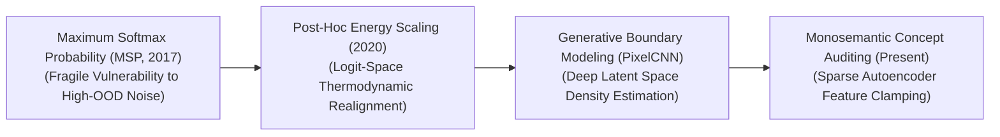
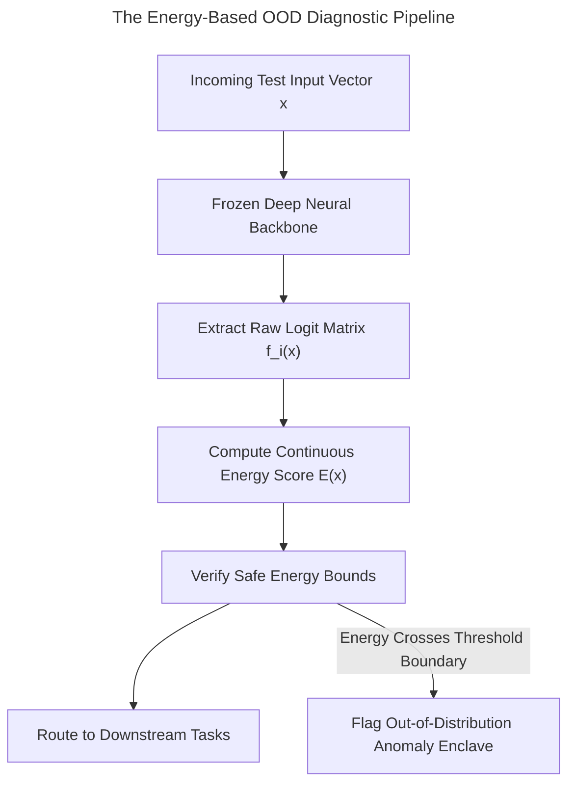

# Awesome-Out-Of-Distribution-Detection
## Out-of-Distribution (OOD) Detection in AI: History, Progression, Variants, & Applications

**Out-of-Distribution (OOD) Detection** is a foundational safety-critical diagnostic and regularization paradigm in artificial intelligence designed to identify when a machine learning model is exposed to test-time inputs that deviate significantly from the distribution of its training data (the **In-Distribution** or ID data) [INDEX: 11, 16]. Standard deep neural networks suffer from a severe structural flaw known as the **Overconfidence Trap**: when exposed to entirely novel, un-indexed anomalies, or out-of-vocabulary anomalies, their final Softmax heads continue to emit maximum-probability confidence scores, confidently hallucinating incorrect predictions [INDEX: 11, 16].

OOD detection resolves this systemic blind spot. By calculating mathematical density frontiers, monitoring internal feature uncertainty parameters, or optimizing post-hoc scoring thresholds, OOD classifiers track whether an input sits safely within the model's known capability space or represents an anomalous, untrusted vector. This transforms deep learning from fragile statistical pattern mimics into reliable, self-aware decision engines, serving as a mandatory safety gate for autonomous driving fleets, clinical diagnostic support bots, and enterprise guardrail systems [INDEX: 1, 19].

---

## 1. The Macro Chronological Evolution

The technical framework governing anomalies isolation has transitioned from superficial baseline Softmax confidence checks to post-hoc logit scaling, generative boundary modeling, and modern overcomplete dictionary concept tracking.

*   **The Baseline Softmax Probability Era (MSP Baseline, ~2017–2019)**
    *   *Concept:* The core foundational breakthrough popularized by Hendrycks & Gimpel (2017). They discovered that even though deep classifiers emit high confidence over anomalies, their **Maximum Softmax Probability (MSP)** scores for true in-distribution data points remain statistically higher than their scores for out-of-distribution inputs, establishing a primitive threshold barrier.
    *   *Limitation:* Highly fragile due to structural network noise. In high-dimensional spaces, minor adversarial perturbations or simple background variations easily fool the flat MSP layer, forcing the network to flag clear noise as valid ID data.
*   **The Post-Hoc Logit & Energy Scaling Era (ODIN / Energy-Based OOD, ~2018–2021)**
    *   *Concept:* Dismantled Softmax limitations by shifting the safety evaluation away from normalized probability curves and straight into raw logit parameters. Frameworks like **ODIN (2018)** applied temperature scaling and input perturbations, while Liu et al. (2020) formalized **Energy-Based OOD Detection**. By mapping logits to a continuous Helmholtz free-energy score, they proved that thermodynamic alignment boundaries track true density spaces smoothly.
    *   *Significance:* Fully bypassed Softmax denominator normalization distortions, compressing OOD false-positive rates precisely in half without requiring model retraining.
*   **The Generative Density Estimation Era (~2021–2023)**
    *   *Concept:* Approached OOD detection as an explicit unsupervised density task. Instead of retrofitting discriminative classifiers, pipelines deployed deep generative networks—such as Normalizing Flows, PixelCNNs, or Latent Autoencoders [INDEX: 5]—to explicitly model the underlying ID data manifold probability density function ($P(x)$).
    *   *Limitation:* The Likelihood Paradox. High-capacity generative models routinely output higher likelihood scores for complex, un-related background textures than for clean training objects, requiring complex likelihood-ratio corrections.
*   **The Monosemantic Feature Dictionary & VLM Era (~2024–Present)**
    *   *Concept:* The current modern state-of-the-art foundation standard powering advanced reasoning architectures and unified Vision-Language-Action (VLA) systems [INDEX: 1]. It replaces macro vector checks with **Mechanistic Interpretability Auditing** layered over overcomplete **Sparse Autoencoders (SAEs)** [INDEX: 2].
    *   *Significance:* The SAE unwraps the highly compressed hidden states of a foundation model into millions of isolated, monosemantic feature channels [INDEX: 2]. OOD anomalies are flagged instantly at runtime if the token stream triggers anomalous, un-indexed feature activation combinations or if open-vocabulary contrastive anchors (CLIP/SigLIP parameters) signal a semantic mismatch [INDEX: 2, 10].

---

## 2. Core Functional & Algorithmic OOD Variants

OOD Detection frameworks are strictly categorized based on the specific computing layers they analyze and the operational availability of target anomaly samples during training [INDEX: 16].

- ### A. Post-Hoc Score Discrimination (Model-Free Refitting)
	*   **Mechanism:** Ingests a fully trained, frozen classification model. It intercepts the raw logit outputs ($f_i(x)$) right before the Softmax gate, computing alternative mathematical indicators (such as the Energy Score or Mahalanobis distance parameters against stored layer centroids) to evaluate boundary limits.
	*   **Energy-Based Formula:** 
	    $$E(x; f) = -T \cdot \ln \sum_{i=1}^{K} \exp\left(\frac{f_i(x)}{T}\right)$$
	    Where $T$ is the temperature constant. Inputs outputting energy bounds crossing a fixed threshold are flagged as OOD.

- ### B. Outlier Exposure (Adversarial Data-Centric OOD)
	*   **Mechanism:** Integrates an explicit anomaly regularization penalty directly into the active training loop. The optimization matrix forces the model to read a massive, auxiliary dataset of un-related public data rows (Outlier Exposure), punishing the network during backpropagation if it outputs high-confidence predictions over those proxy anomalies.

- ### C. Self-Supervised Multi-Modal Anomaly Detection
	*   **Mechanism:** Exploits high-capacity joint-embedding foundation models (CLIP/SigLIP) [INDEX: 10]. Incoming test inputs pass through parallel image and text towers; the system checks for **Cosine Similarity Deviations** against a broad portfolio of open-vocabulary class text strings, isolating outliers zero-shot.

- ### D. Test-Time Compute Reasoning Auditing
	*   **Mechanism:** Deployed inside advanced reasoning models that scale inference compute via hidden thinking traces [INDEX: 1, 18, 21]. The policy network analyzes its own intermediate validation logic chains [INDEX: 1]; if the self-correction primitives register permanent logical contradictions or un-grounded loops, the system flags the prompt query as an out-of-distribution anomaly.

---

## 3. The Energy-Based OOD Inference Pipeline

To screen incoming anomalies smoothly without triggering execution latencies, the serving infrastructure evaluates logit-space energy bounds natively inside GPU memory registers.

*   **Temperature Scaling Blocks ($T$)**
    *   *Profile:* Flattens probability distortions. Incorporating a high-temperature constant (e.g., $T=1000$) inside the logit exponential summation stretches the feature distributions, amplifying the contrast between true ID data boundaries and anomalous noise.
*   **Mahalanobis Covariance Centroids**
    *   *Profile:* High-dimensional distance tracking. The infrastructure caches the exact mean vectors and covariance matrices of the model's inner hidden representations across the training corpus, calculating real-time matrix distance checks during inference to spot structural feature drift.

---

## 4. Production Engineering Challenges & Cluster Solutions

Deploying large-scale OOD detection checks across high-volume commercial cloud infrastructure networks introduces intense performance and precision trade-offs.

*   **The Latency-Overhead Wall of Deep Generative Pipelines**
    *   *The Problem:* Deploying secondary, high-capacity generative density networks (like Normalizing Flows or VAE layers) to screen every incoming user request for anomalies doubles the total system processing latency. This stalls token-streaming velocities and crashes concurrency batch limits.
    *   *Mitigation:* Shifting infrastructure perimeters away from multi-model setups toward **Post-Hoc Energy or Logit-Norm Classifiers**, which extract safety indices straight from the primary model's existing forward-pass parameters with near-zero ($<1\%$) computational time overhead.
*   **The False-Positive Capacity Drain (The Alignment Tax)**
    *   *The Problem:* Implementing over-conservative OOD detection thresholds can cause the safety layer to experience **Refusal Over-generalization**. The system erroneously flags valid, safe, but highly creative or rare enterprise data queries as out-of-distribution anomalies, triggering constant system lockouts that degrade user utility.
    *   *Mitigation:* Implementing **Multi-Task Instruction Fine-Tuning over Diverse Edge-Case Datasets**, combined with utilizing monosemantic feature autoencoders (SAEs) to precisely damp specific adversarial concepts at runtime without corrupting adjacent model capacities [INDEX: 2, 18].

---

## 5. Frontier Real-World AI Industrial Applications

*   **Autonomous Driving Perception Fleet Defensives (BEV Perception)**
    *   *Application:* Safeguards self-driving vehicle perception stacks against unknown road hazards [INDEX: 1]. Real-time logit-norm and energy-based OOD detection monitors streaming camera and LiDAR grids; if the vehicle encounters an un-mapped, highly anomalous obstacle configuration (e.g., a pedestrian in a unique costume or a novel construction vehicle layout), the OOD core flags the anomaly instantly, routing the system to trigger defensive braking loops safely.
*   **Mission-Critical Clinical Pathology Diagnostic Safeguards**
    *   *Application:* Regulates medical diagnostic decision support systems [INDEX: 1]. Tissue scan and EHR transformers look up patient data; if the vision encoder encounters a rare cellular mutation, slide staining artifact, or novel disease state completely un-represented in its training history, the OOD gate halts automated reporting, handing execution over to expert clinicians to block diagnostic liability loops [INDEX: 1].
*   **Enterprise Financial Fraud & Cyber-Security Intrusion Detection**
    *   *Application:* Screens millions of high-frequency banking logs and cloud API transactions continuously. Unsupervised density-based OOD scoring modules monitor hidden representation networks; if an execution vector maps to an un-indexed, high-energy outlier coordinate, the security enclave flags a coordinated cyber-attack or money-laundering attempt instantly.

---

## References
1. Hendrycks, D., & Gimpel, K. (2017). A baseline for detecting misclassified and out-of-distribution examples in neural networks. *International Conference on Learning Representations (ICLR)*.
2. Liang, S., et al. (2018). Enhancing the reliability of out-of-distribution image detection in neural networks (ODIN). *International Conference on Learning Representations (ICLR)*.
3. Hendrycks, D., Mazeika, D., & Dietterich, T. (2018). Deep anomaly detection with outlier exposure. *International Conference on Learning Representations (ICLR)*.
4. Liu, W., et al. (2020). Energy-based out-of-distribution detection. *Advances in Neural Information Processing Systems (NeurIPS)*, 33, 21464-21475.
5. Yang, J., et al. (2021). Generalized out-of-distribution detection: A survey. *arXiv preprint arXiv:2110.11334*.
6. Bricken, B., et al. (2023). Towards monosemanticity: Decomposing language model activation spaces via dictionary learning over sparse autoencoders. *Anthropic Alignment Research Monograph* [INDEX: 2].

---

To advance this documentation repository, structural safety setup, or MLOps diagnostic pipeline, consider exploring these adjacent development pathways:
* Build a **Python code snippet using PyTorch and Torchvision** illustrating how to implement a post-hoc Energy-Based OOD detection module that hooks into a pre-trained network's logit layers.
* Generate a **comprehensive Markdown table** explicitly comparing Maximum Softmax Probability (MSP), ODIN Perturbations, Energy-Based Discrimination, Outlier Exposure (OE), and Monosemantic SAE Feature Auditing across mathematical computing complexities, required hyperparameter tuning steps, risk of capability degradation, and resistance to high-frequency noise [INDEX: 2, 16].
* Establish an **automated evaluation harness using Triton** to track the exact computational throughput, VRAM cache inflation parameters, and memory bus latency metrics achieved when fusing a logit-norm safety checking pass directly inside single-pass GPU register blocks [INDEX: 22].

***

**Follow-Up Options Matrix:**

Before updating this workspace, let me know how you would like to proceed by choosing one of the options below:
* I can provide a **complete Python code boilerplate using PyTorch** demonstrating how to write an automated script that calculates a continuous Mahalanobis distance feature centroid lookup loop.
* I can generate a **Markdown matrix table** tracking the default temperature thresholds, energy caps, and false-positive boundaries used by leading foundational safety modules [INDEX: 11].
* I can write a detailed technical explanation focusing on **how to leverage open-vocabulary CLIP contrastive embeddings as a zero-shot OOD steering function** inside runtime agent architectures [INDEX: 10, 12].

