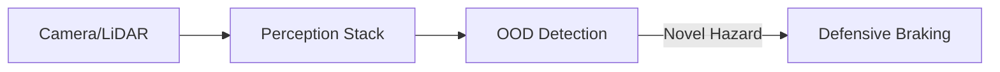

# Autonomous Driving Perception Fleet Defensives

Detailed information about BEV Perception and LiDAR anomaly detection.

```mermaid
flowchart LR
    A[Camera/LiDAR] --> B[Perception Stack]
    B --> C[OOD Detection]
    C -- Novel Hazard --> D[Defensive Braking]
```

[Back to README](../README.md)
