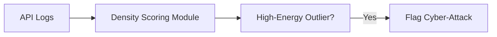

# Enterprise Financial Fraud & Cyber-Security Intrusion Detection

Detailed information about monitoring cloud API transactions for outliers.

```mermaid
flowchart LR
    A[API Logs] --> B[Density Scoring Module]
    B --> C[High-Energy Outlier?]
    C -- Yes --> D[Flag Cyber-Attack]
```

[Back to README](../README.md)
