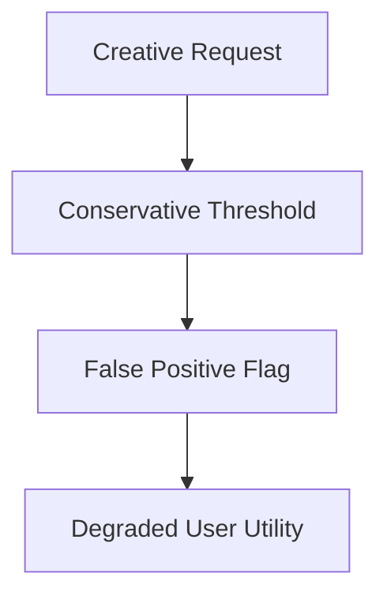

# The False-Positive Capacity Drain

Detailed information about Refusal Over-generalization and the alignment tax.

```mermaid
flowchart TD
    A[Creative Request] --> B[Conservative Threshold]
    B --> C[False Positive Flag]
    C --> D[Degraded User Utility]
```

[Back to README](../README.md)
