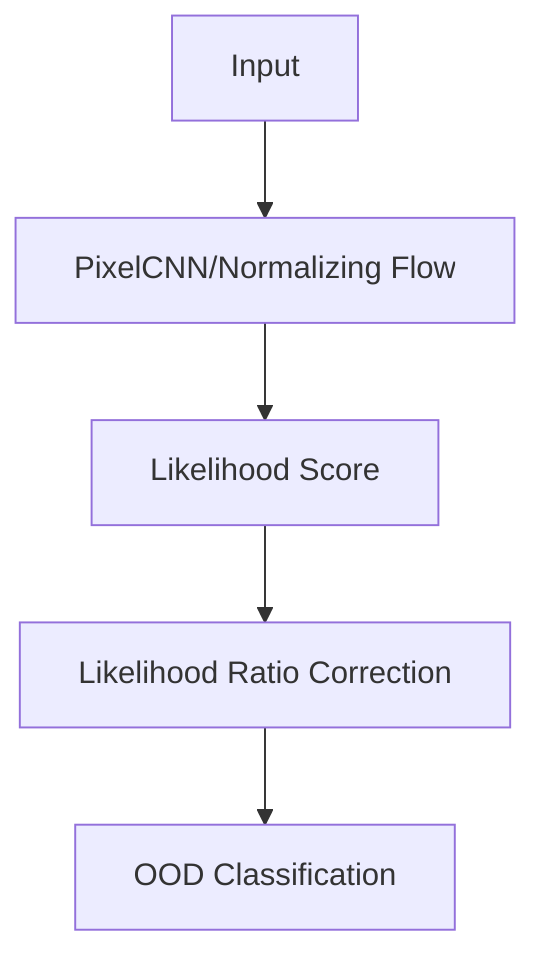

# The Generative Density Estimation Era

Detailed information about using generative models for density estimation.

```mermaid
flowchart TD
    A[Input] --> B[PixelCNN/Normalizing Flow]
    B --> C[Likelihood Score]
    C --> D[Likelihood Ratio Correction]
    D --> E[OOD Classification]
```

[Back to README](../README.md)
