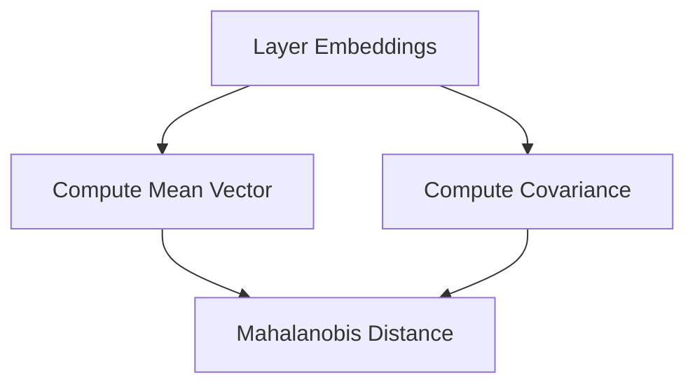

# Mahalanobis Covariance Centroids

Detailed information about tracking high-dimensional distance.

```mermaid
flowchart TD
    A[Layer Embeddings] --> B[Compute Mean Vector]
    A --> C[Compute Covariance]
    B & C --> D[Mahalanobis Distance]
```

[Back to README](../README.md)
