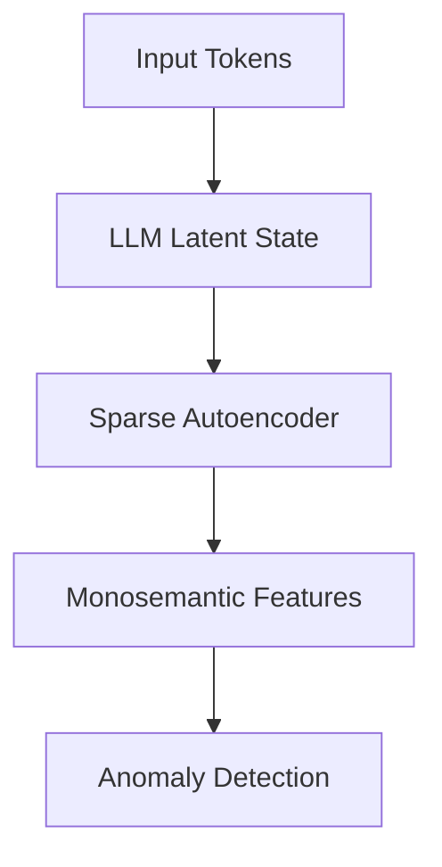

# The Monosemantic Feature Dictionary & VLM Era

Detailed information about Sparse Autoencoders and Concept Auditing.

```mermaid
flowchart TD
    A[Input Tokens] --> B[LLM Latent State]
    B --> C[Sparse Autoencoder]
    C --> D[Monosemantic Features]
    D --> E[Anomaly Detection]
```

[Back to README](../README.md)
