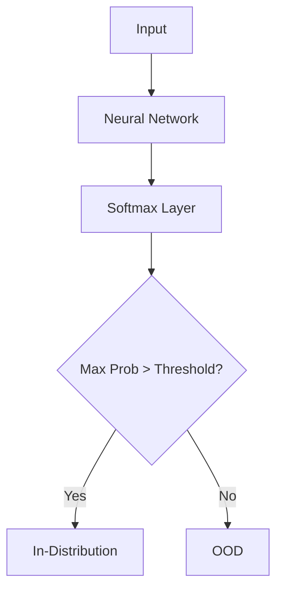

# The Baseline Softmax Probability Era

Detailed information about Maximum Softmax Probability (MSP).

```mermaid
flowchart TD
    A[Input] --> B[Neural Network]
    B --> C[Softmax Layer]
    C --> D{Max Prob > Threshold?}
    D -- Yes --> E[In-Distribution]
    D -- No --> F[OOD]
```

[Back to README](../README.md)
