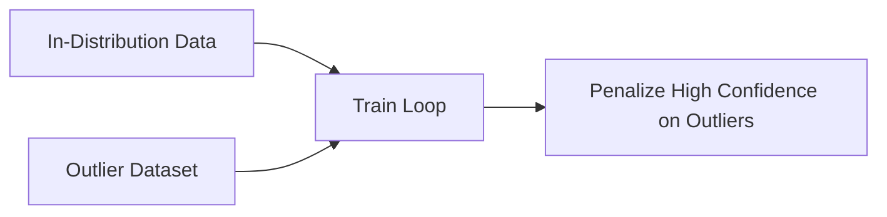

# Outlier Exposure

Detailed information about Adversarial Data-Centric OOD.

```mermaid
flowchart LR
    A[In-Distribution Data] --> B[Train Loop]
    C[Outlier Dataset] --> B
    B --> D[Penalize High Confidence on Outliers]
```

[Back to README](../README.md)
