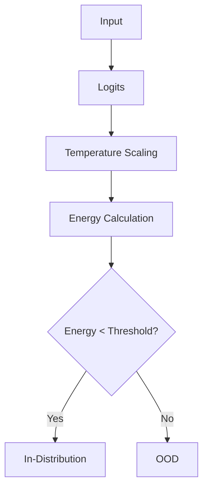

# The Post-Hoc Logit & Energy Scaling Era

Detailed information about Energy-Based OOD Detection.

```mermaid
flowchart TD
    A[Input] --> B[Logits]
    B --> C[Temperature Scaling]
    C --> D[Energy Calculation]
    D --> E{Energy < Threshold?}
    E -- Yes --> F[In-Distribution]
    E -- No --> G[OOD]
```

[Back to README](../README.md)
