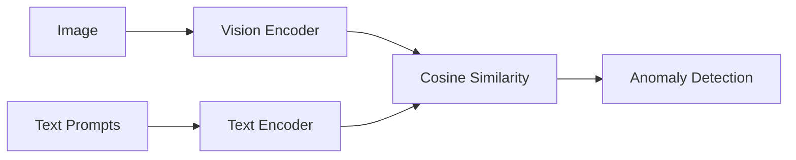

# Self-Supervised Multi-Modal Anomaly Detection

Detailed information about utilizing CLIP/SigLIP for OOD.

```mermaid
flowchart LR
    A[Image] --> B[Vision Encoder]
    C[Text Prompts] --> D[Text Encoder]
    B --> E[Cosine Similarity]
    D --> E
    E --> F[Anomaly Detection]
```

[Back to README](../README.md)
