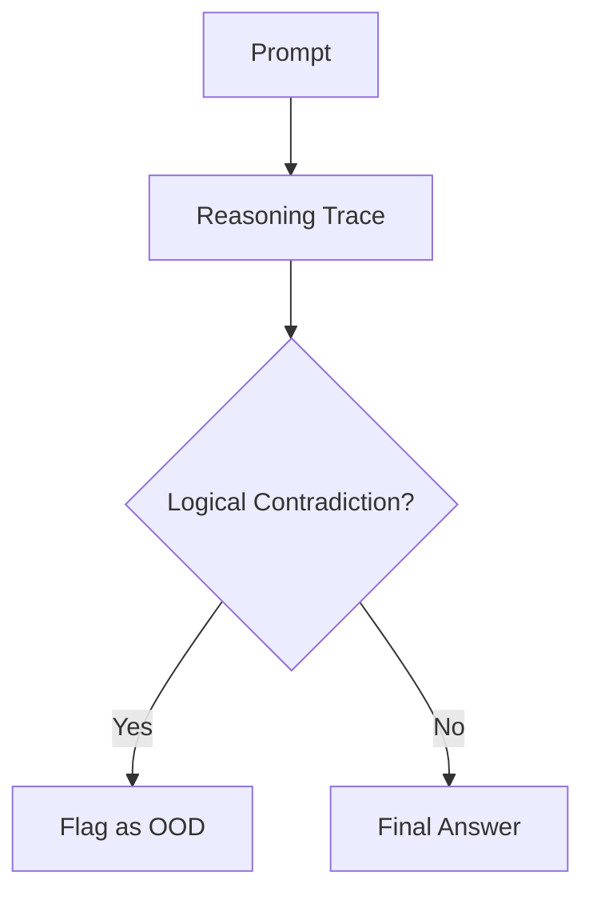

# Test-Time Compute Reasoning Auditing

Detailed information about reasoning models and self-correction.

```mermaid
flowchart TD
    A[Prompt] --> B[Reasoning Trace]
    B --> C{Logical Contradiction?}
    C -- Yes --> D[Flag as OOD]
    C -- No --> E[Final Answer]
```

[Back to README](../README.md)
